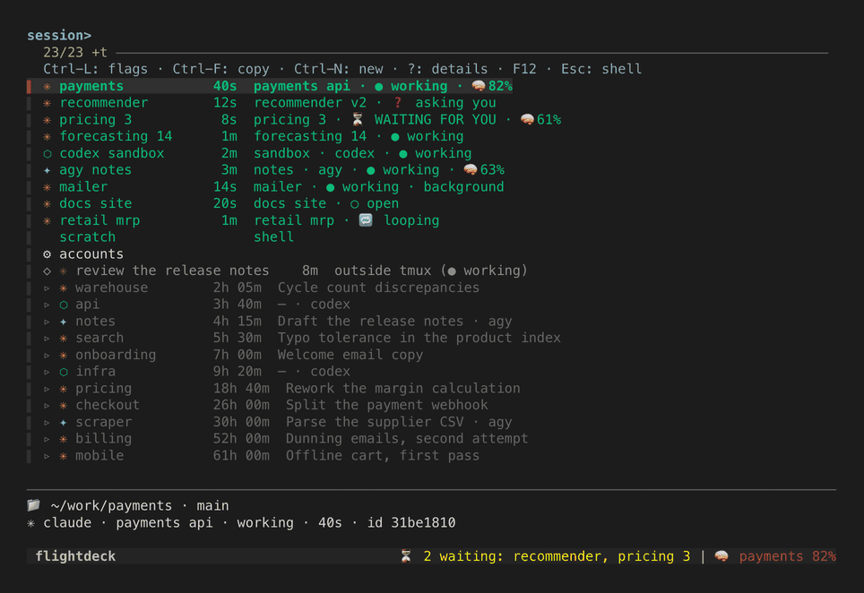
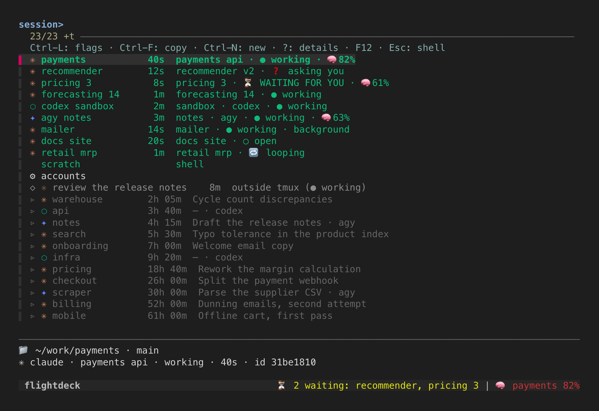
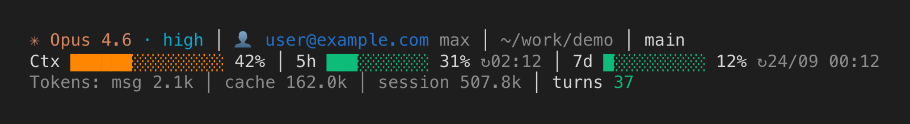

# Flightdeck



*A demo over invented sessions: the menu, walking into one, a notice arriving, a
pinned tool, the flag picker and the status line.*

**One screen for every AI coding session you have open.**

You end up running several coding agents at once — Claude Code in one folder,
Codex in another, Antigravity in a third — and they scatter across terminal
windows you keep losing. Flightdeck puts them all on one full-screen list inside
tmux (the terminal multiplexer that keeps sessions alive after you close the
window): the sessions running right now, the conversations you closed last week,
and the agents running outside tmux. Press Enter on a row and you are inside that
session. Press F12 and you are back on the list.

It also watches. A session that has finished its turn says **waiting for you**; one
that has opened a question for you says **asking you**; one halfway through a job
says **working**. Every conversation shows how much room it has left before its
memory fills up, and when one passes 80 % Flightdeck tells you — so handing over
to a fresh session is a decision you make rather than a surprise you get. The
handover itself is one key: it closes the tired conversation and opens the next
one in the same place, numbered, with the same flags.



## Install

```sh
curl -fsSL https://raw.githubusercontent.com/jvillar/flightdeck/main/install.sh | sh
```

Then open a new shell and type `flightdeck`.

To take the default answer to every question instead of being asked:

```sh
curl -fsSL https://raw.githubusercontent.com/jvillar/flightdeck/main/install.sh | sh -s -- --yes
```

The installer never runs a package manager and never asks for `sudo`. Anything
missing is printed, with the command for your machine, and that is all.
[`docs/INSTALL.md`](docs/INSTALL.md) covers the rest: what gets written where,
the questions it asks, and the `doctor`, `update` and `uninstall` commands.

## The keys

| Key | What it does |
|---|---|
| **Enter** on a green row | jump into that live tmux session |
| **Enter** on a grey row | open a new tmux session in that project's folder and resume that conversation — you carry on with it, adding turns |
| **Ctrl-F** on a grey Claude Code row | open a **copy** of that conversation instead. Same words, new id, so the original stays frozen exactly as you left it |
| **Ctrl-L** on a grey row | resume it **your way**: pick flags from a short list, then edit the whole command before it runs |
| **Ctrl-N** | a new, empty session: a shell you launch whatever you like in |
| **F12** | the switch. From any session it takes you to the menu; from the menu it takes you back where you were |
| **prefix + n** | the handover: close the agent in this pane, open a fresh one in its place |

`prefix` is tmux's own leading key, `Ctrl-b` out of the box. So `prefix + n`
means: press `Ctrl-b`, let go, then press `n`. If F12 is awkward on your keyboard
(a phone's, typically), `prefix + j` also goes to the menu — but only one way,
and you come back by choosing a session with Enter.

[`docs/GUIDE.md`](docs/GUIDE.md) walks through all of it with examples.

## What Flightdeck sees of each tool

| | Claude Code | Codex | Antigravity (`agy`) |
|---|---|---|---|
| Waiting for you / working | yes | yes | yes |
| Asking you a question, looping | yes | no signal | no signal |
| Needs permission | yes | its hook is registered, never seen to fire | no signal |
| Context gauge (🧠) | yes | yes | yes |
| Past conversations in the menu | yes, with titles | yes (no titles: folder and date) | yes (usually no titles: folder and date) |
| Copy a conversation (Ctrl-F) | yes | not offered by the tool | not offered by the tool |
| Pick flags (Ctrl-L) | yes | yes | yes |
| Handover (`prefix + n`) | yes, and the new conversation carries the numbered title | yes, but neither tool can be given a title, so the number lives in Flightdeck | yes, same |

Codex and Antigravity only tell Flightdeck they are there after their **first
turn**: neither announces itself when it opens, so until you ask one of them for
something its session is on the list with nothing said about what is inside it.
[`docs/TOOLS.md`](docs/TOOLS.md) says what each tool tells Flightdeck, and what
it does not.

## The status line

Flightdeck also paints the line under your agent's pane, in three: the model,
the account you are signed in with, the folder and branch; then a bar of context
with its percentage and your rate limits with the time they reset; then the
tokens. Each line fits itself to the pane on its own, and a narrow terminal
loses the branch long before it loses a bar. If you would rather not have your
address on screen, `{ "statusline": { "account": false } }` takes it off.



You choose at install time whether to use it, keep the line you already have, or
stack both. Whatever you had is saved and given back when you uninstall. See
`flightdeck statusline --demo`.

## Requirements

| What | Version | Notes |
|---|---|---|
| tmux | 3.2 or newer | 3.4 and newer print the floating notices more faithfully |
| fzf | 0.36 or newer | 0.71 keeps the cursor on the same session when the list is reordered; the installer offers to download one |
| python3 | 3.9 or newer | standard library only, nothing to `pip install` |
| curl, tar | any | how the release is fetched and unpacked |
| The system | macOS, Linux or WSL2 | on Windows, Flightdeck runs inside WSL2 |

Below the recommended versions things degrade rather than break, and `flightdeck
doctor` tells you which layer you are on. The version each distribution ships,
and what to do about it, is in [`docs/INSTALL.md`](docs/INSTALL.md).

## A day with Flightdeck

1. You open a terminal and type `flightdeck`. The menu fills the screen.
2. Yesterday you left the pricing work half done. You type `pric`, the grey row
   `▹ pricing  18h 40m  Rework the margin calculation` floats to the top, and you
   press **Enter**. A tmux session called `pricing` is created in that project's
   folder, and you watch it type `claude --resume 9f3c…` and pick up where you
   left off.
3. You give it a long job. While it works, **F12** takes you back to the menu.
4. You want to start something else: you type `notes` and press **Ctrl-N**. A
   session called `notes` opens with a shell in it. You `cd` wherever you like and
   launch `claude`, or `codex`, or anything at all, with whatever arguments you
   want. Flightdeck creates shells, not agents, on purpose: if the agent dies, the
   terminal is still there and still usable.
5. A while later, `⏳ pricing is waiting for you` appears at the bottom of the
   screen. **F12**, `pricing` is at the top in green with `⏳ WAITING FOR YOU`,
   Enter, you answer it.
6. Its row now reads `🧠82%`. The conversation is nearly full, so you press
   **prefix + n**. In front of you, `/exit` is typed, the old conversation closes,
   the shell comes back and a new one starts in its place with the same flags,
   its title one number up from the old one's. The old conversation is not lost:
   it drops into the grey history with its title, and Enter brings it back.
7. You go for lunch: `prefix + d` lets go of tmux and everything carries on
   running. From the sofa you SSH in from your phone, type `flightdeck`, and you
   are looking at exactly the same menu. See [`docs/REMOTE.md`](docs/REMOTE.md).

## Documentation

- [`docs/INSTALL.md`](docs/INSTALL.md) — installing, updating, removing, and
  every command's flags.
- [`docs/GUIDE.md`](docs/GUIDE.md) — using it: the menu, the keys, the context
  gauge, the handover, the notices.
- [`docs/TOOLS.md`](docs/TOOLS.md) — Claude Code, Codex and Antigravity: what
  Flightdeck sees of each one.
- [`docs/REMOTE.md`](docs/REMOTE.md) — working from a phone or another machine
  over SSH.
- [`docs/LIMITATIONS.md`](docs/LIMITATIONS.md) — what it does not do, and why.
- [`docs/CONTRIBUTING.md`](docs/CONTRIBUTING.md) — the code, the tests, and how to
  work on it safely.
- [`CHANGELOG.md`](CHANGELOG.md) — what changed in each release.

## Licence and where this came from

MIT — see [`LICENSE`](LICENSE).

Flightdeck grew out of a personal tmux cockpit, used every day to run Claude
Code sessions, and was rewritten into this repository with everything measured
kept and everything personal taken out.
