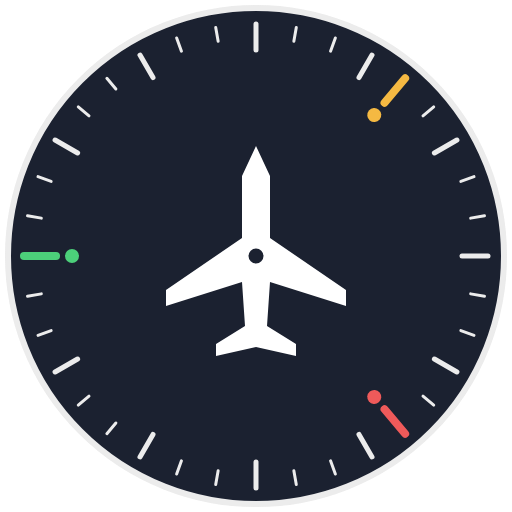

<p align="center">
  
</p>

<h1 align="center">flightdeck</h1>

<p align="center"><b>One screen for every AI coding session you have open.</b></p>


## Why Flightdeck

- 🖥 **A multi-agent terminal.** Claude Code ✳, Codex ⬡ and Antigravity ✦, side by
  side on one full-screen list, each with its own mark.
- 📱 **Sessions that persist across devices.** They live in tmux on your machine:
  close the laptop, open the phone, they are still running.
- 👤 **Several accounts at once.** Every session shows the account it is spending;
  your account switcher is one Enter away.
- 🪟 **Your sessions from several devices at the same time.** Laptop and phone on
  the same session, each with its own menu.
- 🔒 **Remote access that survives an account switch.** Change accounts and every
  session, and your SSH connection to it, stays exactly where it was.
- 🔁 **Sessions that cycle themselves.** A context gauge on every conversation, a
  warning at 80 %, and one key that closes the tired one and opens the next,
  numbered, with the same flags.
- ⏳ **Know who needs you.** Waiting for you, asking you a question, working,
  looping: in the row, in the tmux bar, and as a notice when it changes.
- 🔌 **Nothing else to run.** tmux, fzf and python's standard library; installed
  through the agents' own hooks, and uninstall gives everything back.

## Install

```sh
curl -fsSL https://raw.githubusercontent.com/jvillar/flightdeck/main/install.sh | sh
```

Then open a new shell and type `flightdeck`. The installer never runs a package
manager and never asks for `sudo`; `--yes` takes the default answer to every
question. It needs tmux 3.2, fzf 0.36 and python 3.9 or newer, on macOS, Linux
or WSL2. Everything else is in [`docs/INSTALL.md`](docs/INSTALL.md).

## The keys

| Key | What it does |
|---|---|
| **Enter** | jump into a live session, or resume a past conversation in a new one |
| **Ctrl-F** | open a *copy* of a past Claude Code conversation; the original stays frozen |
| **Ctrl-L** | resume with flags of your choice, editing the whole command first |
| **Ctrl-N** | a new, empty session: a shell you launch whatever you like in |
| **F12** | the switch between the menu and the session you came from |
| **prefix + n** | the handover: close the agent in this pane, open a fresh one in its place |

`prefix` is tmux's leading key, `Ctrl-b` out of the box.

## Documentation

- [`docs/GUIDE.md`](docs/GUIDE.md) — the menu, the keys, the context gauge, the
  handover, the notices.
- [`docs/INSTALL.md`](docs/INSTALL.md) — installing, updating, removing; every
  command and flag; the status line.
- [`docs/TOOLS.md`](docs/TOOLS.md) — what Flightdeck sees of Claude Code, Codex
  and Antigravity.
- [`docs/REMOTE.md`](docs/REMOTE.md) — from a phone or another machine, over SSH.
- [`docs/LIMITATIONS.md`](docs/LIMITATIONS.md) — what it does not do, and why.
- [`docs/CONTRIBUTING.md`](docs/CONTRIBUTING.md) — the code and the tests.
- [`CHANGELOG.md`](CHANGELOG.md) — what changed in each release.

MIT licence — see [`LICENSE`](LICENSE).
